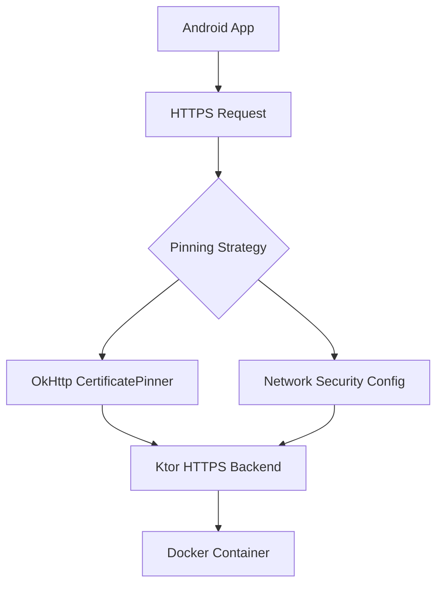
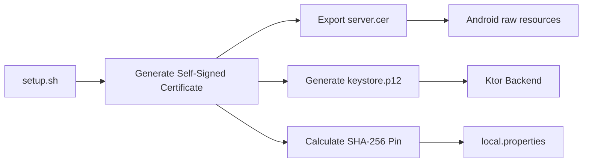
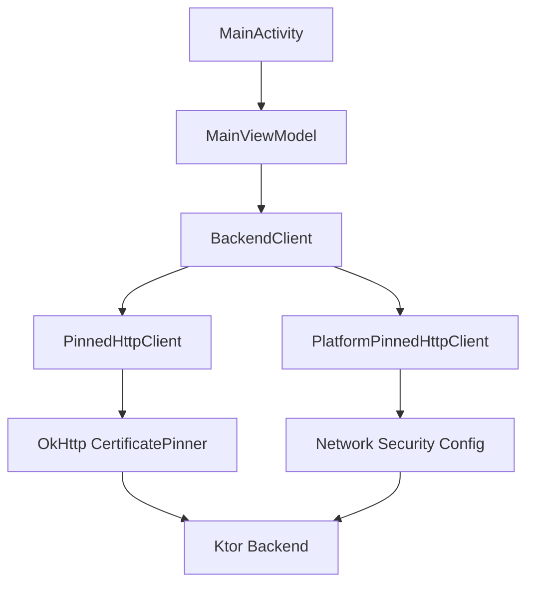
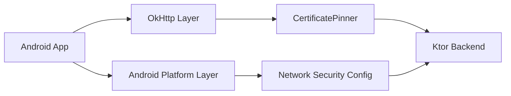

# SSL Pinning Hands-on

Hands-on project to demonstrate SSL/TLS pinning in mobile apps.

Pinning means "fixing" or "anchoring" an expected server identity in the app. Instead of accepting any certificate that the platform considers valid, the app also checks that the backend presents the expected certificate or public key.

In this project, the mobile app validates the backend. The backend is not validating the app certificate. Mutual validation is possible with mutual TLS (mTLS), but that is outside the scope of this hands-on.

This repository contains:

- A minimal Ktor backend running with HTTPS
- An Android client sample
- An iOS client sample
- Scripts to make the environment reproducible

## Project Structure

```text
ssl-pinning-hands-on/
├── backend/
│   ├── ktor-app/
│   ├── certs/
│   └── docker/
├── android/
├── ios/
├── scripts/
├── docker-compose.yml
└── README.md
```

## Goal

The goal of this project is to provide a practical and reproducible SSL/TLS pinning playground for mobile applications.

The repository demonstrates:
- HTTPS backend configuration
- Self-signed certificate generation
- Public key pin extraction
- Android SSL pinning approaches
- Failure scenarios and debugging
- Reproducible local environments using Docker

This project is educational. The certificates used here are for local development only.

Do not use these certificates in production.

## What You Will Learn

### Backend
- How to configure HTTPS in Ktor
- How to generate self-signed certificates
- How TLS works locally with Docker

### Android
- OkHttp CertificatePinner
- Android Network Security Config
- Trust anchors
- Public key pinning
- Failure scenarios
- Hostname verification
- SAN (Subject Alternative Name)

### Security Concepts
- TLS vs SSL pinning
- Trust anchors
- Public key pinning
- Certificate rotation trade-offs
- Debugging pinning failures

## Architecture




## Requirements

- Docker
- Docker Compose
- curl
- Android Studio
- Xcode

## Running the Environment

From the root of the project:

```bash
./scripts/setup.sh
```

The script will:

- Generate local self-signed certificates
- Export `.cer` certificate for mobile clients
- Generate PKCS12 keystore for Ktor
- Copy Android certificate automatically
- Calculate Android SHA-256 pin
- Start Docker backend


The backend will be available at:

```
https://localhost:8443
```

For Android Emulator, use:

```
https://10.0.2.2:8443
```

## Available Endpoints

Health check:

```
 GET /health
```

Expected response:

```
 { “status”: “ok” }
```

Secure data:

```
 GET /secure-data
```

Expected response:

```
 { “data”: “This response comes from a TLS-enabled Ktor backend” }
```

## Testing with curl

Because this backend uses a self-signed certificate, use:

```
curl -k https://localhost:8443/health
```

## Certificates

This project generates local self-signed certificates for demonstration purposes.

During setup, the following files are created:

- `server.pem` → Server certificate
- `key.pem` → Private key
- `server.cer` → Certificate for iOS
- `keystore.p12` → Keystore used by Ktor

## Certificate Flow



## Extracting the SHA-256 Pin (for Android)

To generate the public key pin used in Android:

```
openssl x509 -in backend/certs/server.pem -pubkey -noout \
  | openssl pkey -pubin -outform der \
  | openssl dgst -sha256 -binary \
  | openssl enc -base64
```

Use the output like this:

```bash
sha256/YOUR_BASE64_PIN
```

In this project, "pin" means the expected value the app compares against during pin validation. For public key pinning, that value is the SHA-256 hash of the certificate's public key material, encoded as Base64. OkHttp expects the `sha256/` prefix; Android Network Security Config uses the Base64 value inside a `<pin digest="SHA-256">` element.

## Public Key Pin vs Certificate Hash

This project uses public key pinning for Android. The pin is calculated from the certificate's public key, not from the full certificate bytes.

That distinction matters during certificate rotation:

- Reissuing or renewing a certificate with the same key changes the certificate hash.
- Reissuing or renewing a certificate with the same key keeps the public key pin stable.
- Generating a new key changes the public key pin.

To see this locally without modifying the demo certificates:

```bash
./scripts/demo-public-key-pin-rotation.sh
```

The script creates temporary certificates and compares:

- A full certificate SHA-256 hash.
- A public key SHA-256 pin.
- A renewed certificate using the same key.
- A new certificate using a new key.

## Pin Rotation Guidelines

Pinning is not only a code decision. It also requires an operational rotation plan.

General guidelines:

- Prefer public key pinning over full certificate hash pinning unless you have a specific reason to pin the full certificate.
- Use a pinset, not a single pin.
- Keep at least one active pin and one backup pin.
- Generate the backup key before you need it.
- Release an app version that contains both the active pin and the backup pin.
- Wait for enough users to adopt that app version before switching the server to a new key.
- Renew certificates freely when they keep the same public key.
- If the public key must change, switch to a key that is already present as a backup pin in released app versions.
- After migration, release a new app version with a new backup pin.
- Monitor pinning failures so rotation problems are detected quickly.

Without a rotation strategy, pinning can turn a security control into an availability problem.

## First Run Validation

After running the setup script, validate the backend:
```bash
curl -k https://localhost:8443/health
```

Expected response:
```json
{ “status”: “ok” }
```

## Android SSL Pinning

This project demonstrates two Android approaches:

### 1. OkHttp CertificatePinner

Application-level pinning using:

- OkHttp
- CertificatePinner
- Public key pin validation

Enable it with:

```properties
USE_OKHTTP_PINNING=true
```

---

### 2. Network Security Config

Platform-level pinning using:

- `network_security_config.xml`
- Android trust anchors
- XML-defined pinning

Enable it with:

```properties
USE_OKHTTP_PINNING=false
```

## Android Architecture



## Android Pinning Approaches



## Android Local Configuration

After running `./scripts/setup.sh`, copy the generated `SSL_PIN` value into:

`android/local.properties`

Example:

```properties
SSL_PIN=sha256/YOUR_GENERATED_PIN
USE_OKHTTP_PINNING=true
```
Use USE_OKHTTP_PINNING=false to test the Network Security Config approach.

## Failure Scenarios

This project intentionally demonstrates failure cases:

- Invalid SSL pins
- Hostname verification failures
- Missing trust anchors
- Platform pin validation failures

These scenarios help understand:
- How SSL pinning actually works
- How different Android layers behave
- How debugging differs between approaches


## Educational Notes

This backend exists to support SSL pinning demos.

It is intentionally simple:

- No authentication
- No database
- No API Gateway
- No production certificate authority

The focus is mobile SSL/TLS pinning, not backend architecture.

## Clients

- Android app using OkHttp CertificatePinner
- Android app using Network Security Config
- iOS app using URLSession certificate pinning (planned)
- iOS app using public key pinning (planned)

## Quick Troubleshooting

- If port 8443 is already in use, stop the conflicting service or change the port in docker-compose.yml
- If Docker is not running, start it before executing the script
- If curl fails, try adding the -k flag to ignore certificate validation

## Current Status

### Backend
- [x] HTTPS Ktor backend
- [x] Dockerized environment
- [x] Self-signed certificate generation

### Android
- [x] OkHttp CertificatePinner
- [x] Network Security Config
- [x] Failure scenarios
- [x] Reproducible setup

### iOS
- [ ] URLSession certificate pinning
- [ ] Public key pinning
- [ ] Alamofire approach
